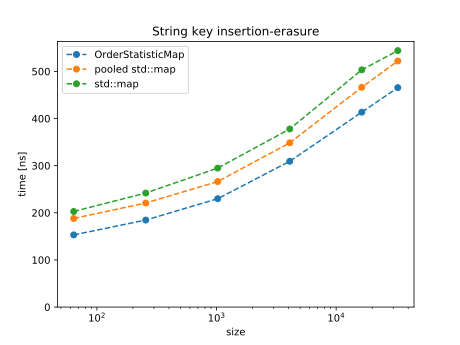
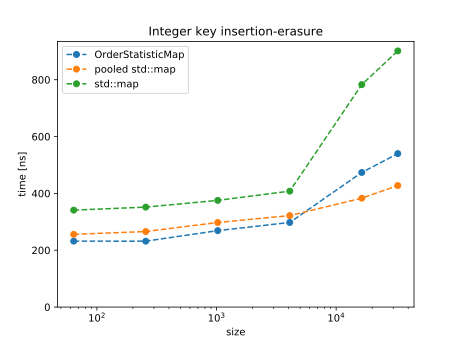

# Random Access Map Library
This header only library provides efficient implementations of an ordered map or set data structure, 
with additional features aimed toward, but not limited to, Monte Carlo sampling. 

Insertion, removal, and access to the i-th ordered element are all O(log n) operations.

An additional container `SamplingMap` allows to sample with a random number generator in O(log n)
a value stored in the map, with an automatically normalized user defined discrete pdf.  

# Installation
The library is headers only, just copy the content of the `include` folder somewhere in your include
search path.

## Documentation
TBA

`RandomAccessMap` and `SamplingMap` functionalities and interfaces are a superset of `std::map`, 
with the exception of `operator[]` being replaced by `insert` and `findByKey`, due to the need to 
distinguish the access method from `findByIndex`.

## Performance
The `RandomAccessMap` container consistently outperforms the standard library `std::map` for different types and sizes of
inputs, despite the need to perform a small number of extra operations to keep the indexing up to data.
The difference is larger in a cold cache scenario.

When erasure is performed, pointers rather than values are moved around, keeping other iterators
valid. This also allows to efficiently insert and erase key-value pairs with a large stack size,
while paying a negligible price for pairs smaller than the pointers stored in a node.

`RandomAccessMap::insert` (`RandomAccessMap::erase`) is optimized for the case of an insertion of
a not yet present (already present) key.

The following benchmarks were run using the [Google benchmark](https://github.com/google/benchmark)
library on an Intel(R) Core(TM) i7-8700K CPU. The performance is also compared to `std::unordered_map` 
for reference, despite it being a different container with different properties.

### Cold cache 
The insertion-erasure test is performed by adding and removing different keys at each iteration, keeping
the container size constant during sampling.  

The find test is performed by searching different keys at each iteration. 

### Warm cache
The warm cache tests are performed by reusing recently used keys. This also removes most of the 
rebalancing cost from the measurement.

## Conclusion
On top of providing Monte Carlo specific features it is 
advantageous to use the provided `RandomAccesMap` over `std::map` for general applications, if 
the additional O(1) memory usage is not a concern, or the container allocation needs not be 
shrinked during its lifetime.
